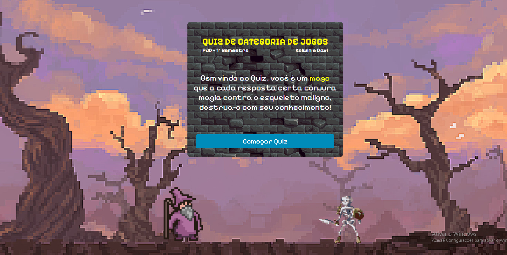

# 🧙‍♂️ Quiz do Mago — Desafie a Caveira com o Poder do Conhecimento! 💀✨

Neste projeto épico, você é um mago poderoso que precisa derrotar uma caveira maldita em um duelo de sabedoria! A cada pergunta correta, você conjura uma magia e enfraquece o inimigo. Mas cuidado: respostas erradas te deixam vulnerável...

## 🔮 Tecnologias Utilizadas

- HTML5
- CSS3 (com estilo místico!)
- JavaScript puro (sem bibliotecas externas!)

## 🧩 Como Funciona

1. O quiz começa com a introdução da batalha.
2. Uma pergunta aparece com múltiplas alternativas.
3. Ao escolher a alternativa correta:
   - Uma animação de feitiço é disparada contra a caveira. 💥
4. Se errar, o mago sofre um pequeno golpe da caveira. ☠️
5. Derrote a caveira respondendo todas as perguntas corretamente!

## 🎮 Jogar Agora

Acesse:
https://quizcategoria.vercel.app/

